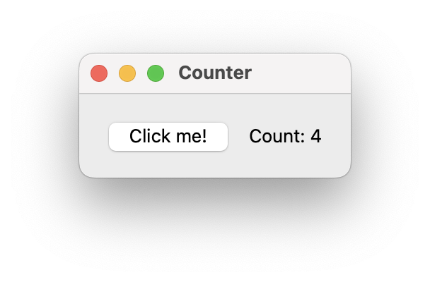

# moonbridge

[中文](./README.md) | [English](./README.en.md)

`moonbridge` 是一个给 MoonBit 原生 FFI 使用的 C++ 头文件库，目标是让 MoonBit 与 C++ 之间的类型绑定、引用计数和闭包传递更可控。

它的主要用途是：为 C++ 库实现 MoonBit binding。

这是一个单头文件（single-header）库，核心入口是 `include/moonbridge.hpp`。

当前仓库包含：

- `include/moonbridge.hpp`：核心桥接实现
- `example/lib`：示例绑定实现
- `example/mbt`：MoonBit 侧声明与示例应用

## 特性

- Single-header：核心实现集中在 `include/moonbridge.hpp`。
- 面向 MoonBit ABI：提供 `moonbit_trait<T>` 与常用包装类型。
- 外部对象桥接：通过 `box<T>` 把 C++ 对象安全暴露给 MoonBit。
- 闭包桥接：`fn<R(Args...)>` 可承载 MoonBit 闭包。
- 持久持有语义：`own<T>` 用于在 C++ 侧长期保存 MoonBit 对象并维护引用计数。
- 类型擦除技巧支持：`fat<T>` 可以提取 Trait Object（胖指针）中的对象。

## 依赖

- 支持 C++23 的编译器
- MoonBit 工具链与运行时头文件（默认从 `~/.moon/include` 引入）
- [xmake](https://xmake.io)（仅示例需要）
- Qt（仅示例需要）

## 构建说明（现状）

示例当前只能稳定运行在**已安装 Qt 的 macOS** 上。

当前示例流程：

1. 先构建 C++ 侧示例库（Qt）。
2. 再由 MoonBit native 目标链接该库。

`xmake.lua` 中 `example` 目标会把构建产物复制到仓库根目录 `build/`，MoonBit 侧通过 `-L../../build -lexample` 以及 Qt framework 参数链接。

有兴趣的用户可以自行尝试按照 [Moonbit 文档](https://docs.moonbitlang.com/zh-cn/latest/toolchain/moon/module.html#experimental-pre-build-config-script) 中的方法实现构建脚本以传递链接参数。

对于 macOS 以外平台，请自行研究 Qt 动态库链接方式，并按目标平台修改链接参数。

macOS（已安装 Homebrew）下可按以下方式运行示例：

```sh
brew install qt
xmake
cd example/mbt
moon run --target native cmd/main
```

## 示例

当前示例演示的是一个用 Qt 实现的计数器。您可以参考示例中 moonbridge 的用法。



## 致谢与灵感来源

本项目的思路受到 [moonbit-community/qpainter.mbt](https://github.com/moonbit-community/qpainter.mbt) 启发，作者是 illusory0x0（猗露）。  
该项目目前已不再更新，特此致谢。

## 许可证

Apache-2.0。
